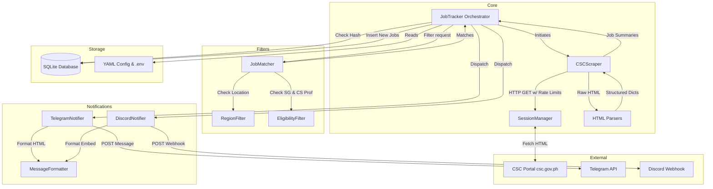

# System Architecture

The CSC Bicol Job Scraper uses a modular, layered architecture to cleanly separate concerns between fetching data, filtering it, storing state, and sending alerts.

## High-Level Architecture Diagram

## Module Responsibilities

1. **Scraper Layer (`src.scraper`)**
   - **`SessionManager`**: Handles network resiliency. Implements automated retries, rate-limiting (respecting HTTP 429 headers), and User-Agent rotation.
   - **`CSCScraper`**: Manages the multi-page traversal logic and page fetching.
   - **`parsers.py`**: A pure, stateless utility module that uses `BeautifulSoup` to transform raw HTML into dictionary objects.

2. **Filter Layer (`src.filters`)**
   - Implements complex text normalization to handle inconsistent data entry on the CSC portal (e.g. standardizing "Cam. Sur" to "Camarines Sur").
   - Validates if a job meets the user's criteria before processing it further.

3. **Storage Layer (`src.storage`)**
   - Maintains an SQLite database (`data/csc_jobs.db`).
   - Generates a SHA-256 hash based on job metadata to identify uniqueness and achieve idempotency, ensuring the same job is never alerted twice even if its URL changes.
   - Tracks notification delivery success/failure for each integration.

4. **Notification Layer (`src.notifications`)**
   - Converts the internal job dictionaries into platform-specific rich formats.
   - Dispatches asynchronous network calls to target APIs.
